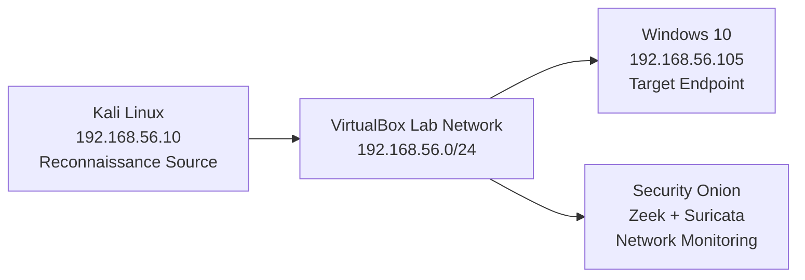
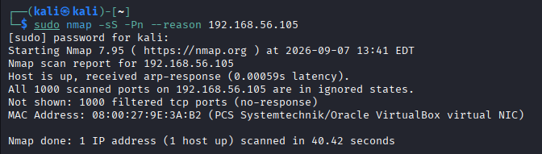
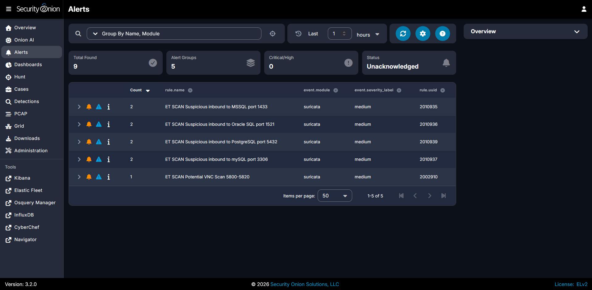
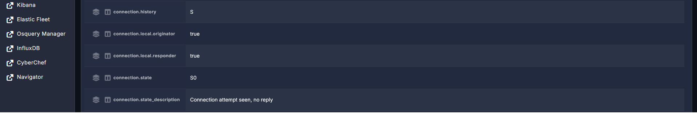
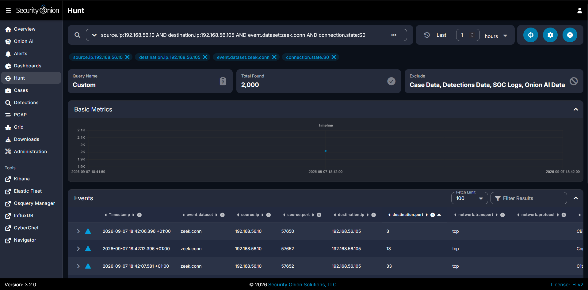
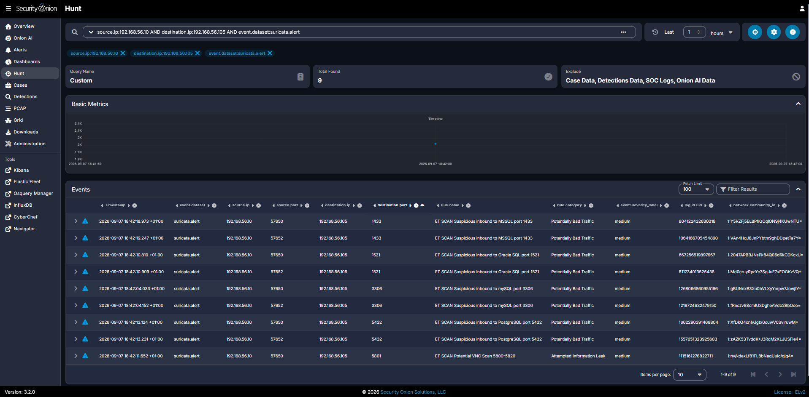
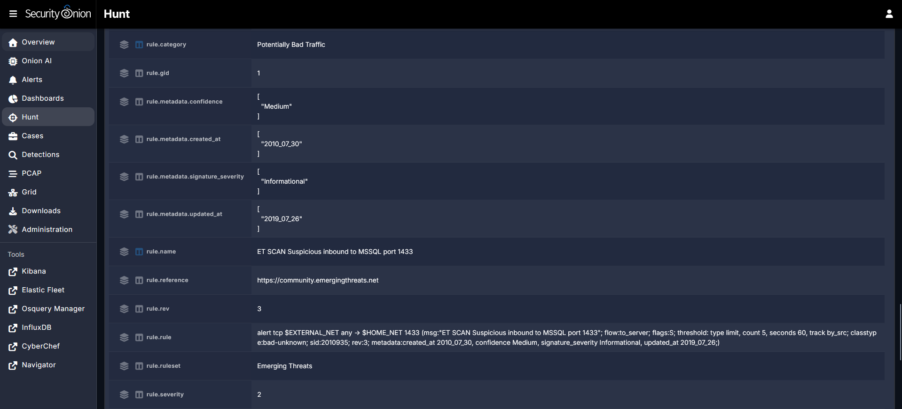

# Internal Network Reconnaissance Detection and Investigation

## Objective

Detect and investigate suspicious internal network reconnaissance using Security Onion, Zeek, and Suricata.

The goal of this project is to simulate TCP port reconnaissance against a Windows endpoint, analyze the resulting network telemetry, determine whether the activity is consistent with automated scanning, scope the observed activity, and document the findings from a SOC analyst perspective.

## Lab Environment

* Kali Linux — simulated source of reconnaissance
* Windows 10 — target endpoint
* Security Onion 3.2.0 — network monitoring and investigation platform
* Zeek — network connection telemetry
* Suricata — network intrusion detection
* VirtualBox — isolated lab environment

## Network Topology

The investigation was performed inside an isolated VirtualBox lab network. Kali Linux generated the reconnaissance traffic against the Windows 10 endpoint while Security Onion monitored the network traffic using Zeek and Suricata.



## Scenario

A SOC analyst observes suspicious internal network activity from `192.168.56.10` targeting the Windows endpoint `192.168.56.105`.

The source host appears to be attempting connections to many TCP ports within a short period of time. The objective of the investigation is to determine whether the activity represents isolated connection attempts, legitimate administrative activity, or automated network reconnaissance.

The investigation focuses on:

- identifying the source and target systems
- determining the scale and pattern of the connection attempts
- reviewing Suricata alerts
- correlating those alerts with Zeek connection telemetry
- determining whether the behavior is consistent with port scanning
- scoping whether the source targeted additional systems
- deciding whether the activity should be escalated

## Activity Simulation

To generate controlled reconnaissance traffic, Kali Linux was used to perform a TCP SYN scan against the Windows 10 endpoint.

Command used:

```bash
sudo nmap -sS -Pn --reason 192.168.56.105

```

### Command Breakdown

- `sudo` — runs Nmap with the privileges required to send raw TCP packets
- `nmap` — network scanning tool used to discover hosts, ports, and services
- `-sS` — performs a TCP SYN scan
- `-Pn` — skips host discovery and treats the target as online
- `--reason` — shows why Nmap classified each port state

The scan targeted Nmap's default set of 1,000 commonly used TCP ports.

The Windows host did not respond to the TCP SYN probes, resulting in the ports being classified as filtered.



## Detection

Security Onion detected the reconnaissance activity using Suricata.

The scan generated 9 Suricata alerts across 5 different alert groups. The alerts were associated with connection attempts to commonly targeted service ports, including:

- TCP 1433 — commonly associated with Microsoft SQL Server
- TCP 1521 — commonly associated with Oracle Database
- TCP 3306 — commonly associated with MySQL
- TCP 5432 — commonly associated with PostgreSQL
- TCP 5801 — within a VNC-related port range

These alerts indicate that the traffic matched scan-related detection rules. They do not prove that these services were actually running on the Windows endpoint.



## Investigation

### Zeek Connection Analysis

To investigate the underlying network activity, Security Onion Hunt was used to review Zeek connection logs between the suspected source and target.

Query used:

```text
source.ip:192.168.56.10 AND destination.ip:192.168.56.105

```

Zeek recorded a large number of connection attempts from `192.168.56.10` to different TCP ports on `192.168.56.105`.

One of the connection records showed:

- `connection.history: S`
- `connection.state: S0`
- `connection.state_description: Connection attempt seen, no reply`

In Zeek, `S0` indicates that the originator sent a connection attempt but no response was observed from the destination.

This correlates with the Nmap result, which classified the scanned ports as filtered because no response was received.



### Scale and Pattern Analysis

To determine whether the activity was isolated or automated, the Zeek connection logs were filtered for unanswered connection attempts between the same source and target.

Query used:

```text
source.ip:192.168.56.10 AND destination.ip:192.168.56.105 AND event.dataset:zeek.conn AND connection.state:S0
```

The query returned 2,000 Zeek connection records.

All matching records were in the `S0` state, meaning the source initiated connection attempts but no reply was observed from the target.

The large number of connection attempts across many destination ports within a short time window is consistent with automated TCP port scanning rather than normal user activity.



### Suricata Correlation

The Zeek findings were correlated with Suricata alerts generated during the same activity.

Query used:

```text
source.ip:192.168.56.10 AND destination.ip:192.168.56.105 AND event.dataset:suricata.alert
```

The query returned 9 Suricata alerts associated with multiple destination ports, including TCP 1433, 1521, 3306, 5432, and 5801.

The alerts were generated by Emerging Threats scan-related rules and were classified as medium severity in Security Onion.

This supports the conclusion that the activity was not an isolated failed connection. Multiple scan-related signatures were triggered by the same source host against the same target within a short period of time.



### Suricata Rule Inspection

One of the Suricata alerts was inspected in detail to understand why the traffic triggered a detection.

The alert targeted TCP port `1433` and matched the rule:

`ET SCAN Suspicious inbound to MSSQL port 1433`

Relevant rule details included:

- `rule.category: Potentially Bad Traffic`
- `rule.severity: 2`
- `rule.metadata.confidence: Medium`
- `rule.metadata.signature_severity: Informational`
- TCP SYN flag detection using `flags:S`

The rule matched because the scan generated TCP SYN traffic toward a port commonly associated with Microsoft SQL Server.

This alert does not prove that Microsoft SQL Server was running on the endpoint. It only shows that the traffic matched a scan-related rule targeting TCP port `1433`.

The word `inbound` is part of the Emerging Threats rule name and does not mean that the traffic originated from the Internet. In this lab, both `192.168.56.10` and `192.168.56.105` were internal hosts on the `192.168.56.0/24` VirtualBox network.



### Scope Analysis

To determine whether the suspected source targeted additional systems, the destination restriction was removed and Zeek connection telemetry from `192.168.56.10` was reviewed.

A second query was then used to search specifically for connections from the source to any destination other than the Windows endpoint:

```text
source.ip:192.168.56.10 AND event.dataset:zeek.conn AND NOT destination.ip:192.168.56.105
```

The query returned `0` events.

Within the investigated time window and the telemetry available to Security Onion, no Zeek connection records were observed from `192.168.56.10` to another destination.

This indicates that the observed reconnaissance activity was scoped to the single Windows endpoint `192.168.56.105`.

## Incident Timeline

| Time | Event |
|---|---|
| 18:42:03.476 | Zeek first observed TCP connection attempts from `192.168.56.10` to `192.168.56.105`. |
| 18:42:04.033 | Suricata generated the first scan-related alert. |
| 18:42:19.247 | Last Suricata scan alert observed during the investigation window. |

The Zeek connection-start timestamps showed rapid burst of activity consistent with automated scanning, while Suricata generated scan-related alerts during the same period.

### Timestamp Note

The Kali Linux VM and Security Onion were configured with different time zones during the investigation. Kali displayed timestamps in EDT (UTC-4), while Security Onion displayed timestamps in UTC+1. The timestamps were therefore compared after accounting for the five-hour time difference.

## Indicators and Observables

| Type | Value | Role |
|---|---|---|
| Source IP | `192.168.56.10` | Host observed initiating TCP reconnaissance |
| Destination IP | `192.168.56.105` | Target Windows endpoint |
| Alerted Ports | `1433`, `1521`, `3306`, `5432`, `5801` | Destination ports that triggered Suricata scan alerts |

## MITRE ATT&CK Mapping

### T1046 — Network Service Discovery

The observed activity maps to **T1046 — Network Service Discovery** because the source host attempted connections across many TCP ports in order to identify potentially reachable network services.

Evidence supporting this mapping:

- `192.168.56.10` probed many destination ports on `192.168.56.105`
- 2,000 Zeek `S0` connection records were observed
- 9 Suricata scan-related alerts were generated
- the activity occurred in a rapid pattern consistent with automated scanning

## Findings and Analyst Verdict

The investigation found that `192.168.56.10` performed activity consistent with automated TCP port reconnaissance against `192.168.56.105`.

Key findings:

- 2,000 Zeek connection records were observed between the source and target
- all matching Zeek records were in the `S0` state, indicating connection attempts with no observed reply
- 9 Suricata scan-related alerts were generated across multiple destination ports
- the activity was limited to a single observed target within the investigated time window
- the behavior mapped to MITRE ATT&CK technique `T1046 — Network Service Discovery`

The Suricata detections are considered true positives because scan activity genuinely occurred.

However, the available network evidence does not by itself prove malicious intent. In a real SOC environment, the next step would be to identify the source asset and owner and determine whether the scanning activity was authorized.

If the activity was unauthorized, the incident should be escalated for deeper investigation of the source endpoint and any related activity.

## Recommendations and Remediation

In a real environment, the following actions would be appropriate:

- identify the asset and owner associated with `192.168.56.10`
- verify whether the scan was part of an authorized vulnerability assessment, administrative task, or other approved activity
- if unauthorized, investigate the source endpoint for additional indicators of compromise and suspicious activity
- review authentication, process, endpoint, and additional network telemetry associated with the source host
- determine whether the source attempted follow-on activity after the reconnaissance
- escalate the incident if additional evidence suggests compromise or malicious intent

If the scanning activity is legitimate and expected, detection tuning should be considered carefully rather than completely suppressing alerts from the source host. Any tuning should be narrow enough to avoid creating a blind spot if the authorized scanner is later misused or compromised.

## What I Learned

- I learned the difference between Suricata alerts and Zeek telemetry. Suricata matches traffic against suspicious or malicious patterns defined in detection rules, while Zeek stores much more detailed information about traffic for more in-depth investigation. Using them together bridges the gap between immediate threat detection and the deep context needed for deeper investigation.
- I learned the difference between a security incident and a true positive, a security incident is an unauthorized or unexpected event that affects or could negatively affect the security of a system or organization. On the other hand, a true positive means the detection correctly identified the behavior it was designed to detect. The difference is that a true positive does not necessarily  mean the activity is malicious.
- I learned why an internal scanner isn't automatically malicious, the action can be legitimate because scanners can be used to find unpatched software, weak configurations, open ports, asset inventory and much more, all this to keep the system more secure and keep track of devices on the network.
- I learned why alert names shouldn't be blindly trusted. For example, when Suricata triggers an alert with the rule name "ET SCAN Suspicious Inbound to MSSQL port 1433" it does not mean that MSSQL is running on the device, it simply means that the signature rule was triggered because port 1433 is a common scanned port for MSSQL by malicious actors, ultimately the alert name describes what the detection rule matched, not the victim's actual environment.
- I learned how to scope whether a source targeted other hosts, using the command mentioned in Scope Analysis I was able to determine that within the investigated time window, no Zeek connection records showed 192.168.56.10 communicating with another destination. This indicates the scope was limited to a single Windows endpoint.
- I learned why you shouldn't automatically whitelist legitimate scanners, this is a bad practice because it could mean that if a legitimate scanner on the network is compromised this would create a massive blind spot, possibly allowing the attacker to move laterally across the network undetected and significantly delaying the SOC's incident response time.